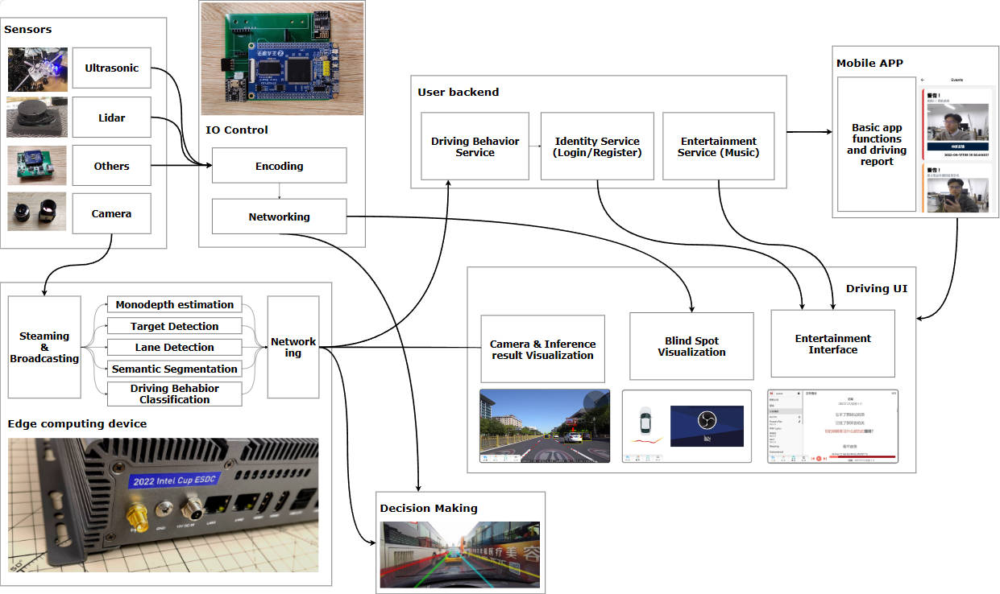

## Hi

This is an outdated assisted driving system that was born to train ourselves in the process of learning various technologies. This project was created by [VisualDust](https://github.com/visualDust) and maintained by multiple members. Maintenance has been completely stopped, waiting for new upgrades. Specifically, the warehouse owner is learning new 3D-based methods and end-to-end approaches and re-architecting the project.

architecture: (There is actually an image below, but it doesn't seem to load correctly.)

